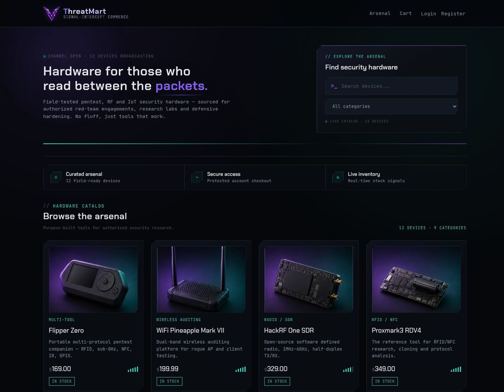

# ThreatMart

> Signal-intercept commerce for authorized security research.

[](https://void-cyber-store.onrender.com/)
[](https://nodejs.org/)
[](https://www.sqlite.org/)

ThreatMart is a full-stack cybersecurity and IoT hardware marketplace with a premium dark interface, responsive product discovery, secure account flows, persistent cart, checkout, order history, and an admin operations console.

## Live demo

**[Launch ThreatMart →](https://void-cyber-store.onrender.com/)**

> The free hosting instance may take a few seconds to wake up on the first visit.

## Screenshots

### Storefront



### Crystal brand identity

<p align="center">
  
</p>

## Highlights

- Modern cyber-commerce UI with crystal-purple branding, responsive layouts, micro-interactions, and scroll reveals
- Searchable catalog with category filters, stock signals, realistic product imagery, and product detail pages
- Secure registration and login with bcrypt password hashing and JWT authentication in an HTTP-only cookie
- Persistent shopping cart, stock-aware checkout, and customer order history
- Admin dashboard with store metrics, product management, inventory controls, users, orders, and fulfillment status
- SQLite-backed API built with Node.js and Express

## Tech stack

| Layer | Technology |
|---|---|
| Frontend | HTML5, CSS3, Vanilla JavaScript |
| Backend | Node.js, Express |
| Database | SQLite with `better-sqlite3` |
| Authentication | bcryptjs, JWT, HTTP-only cookies |
| Deployment | Render |

## Run locally

```bash
git clone https://github.com/vasanth-void-0x/void-cyber-commerce.git
cd void-cyber-commerce
npm install
npm start
```

Open `http://localhost:3000` in your browser.

For development with automatic restart:

```bash
npm run dev
```

## Project structure

```text
void-cyber-commerce/
├── public/             # Storefront, account, cart and admin UI
├── server.js           # Express app and API routes
├── db.js               # SQLite schema, seed data and queries
├── package.json        # Scripts and dependencies
└── docs/screenshots/   # README previews
```

## Responsible use

ThreatMart is a portfolio and educational project. The catalog is presented for authorized security research, defensive testing, and lab use only.

---

Built by [Vasanth](https://github.com/vasanth-void-0x).
